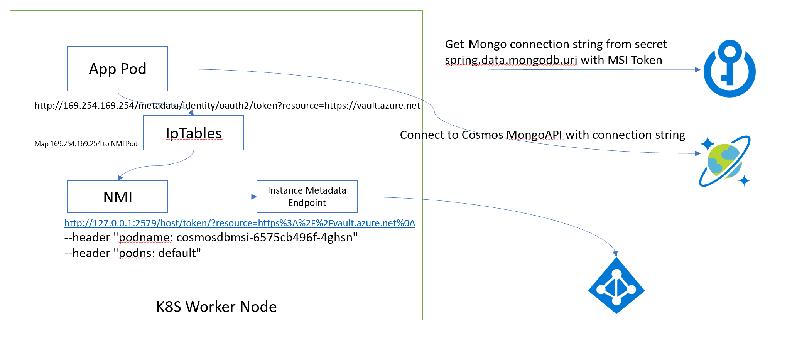

# SpringBoot Demo on how to use CosmosDB with Azure AKS AAD Pod Identities

This application will use AKS [AAD Pod Identity](https://github.com/Azure/aad-pod-identity)to Connect to Vault and retrieve Mongo connection string for CosmosDb instance.
It uses [Azure SpringBoot KeyVault Starter](https://github.com/microsoft/azure-spring-boot/tree/master/azure-spring-boot-starters/azure-keyvault-secrets-spring-boot-starter) to automate communications to Vault and present values of secrets as SpringBoot configuration properties.




## Build Docker and Push to ACR 

Build code using Maven, build docker image and push to ACR using ACR Tasks 
Docker image uses laeers for optimization

```
mvn clean package -DskipTests
az.cmd acr build --registry <registryname> -g <resourcegroup> --image cosmosmsi:latest . 
```

## Create AAD IDdentity and setup it's permissions
To assign MSI to application running in K8S use [AAD Pod Identity](https://github.com/Azure/aad-pod-identity) project.

1. Install AAD Pod identity

```
kubectl apply -f https://raw.githubusercontent.com/Azure/aad-pod-identity/master/deploy/infra/deployment-rbac.yaml
```
2. Create Managed Identity and record the output Json
```
 az identity create -g <resourcegroup> -n <identityname> -o json
{
  "clientId": "xxxxx-2bb7-4d06-ba43-cff38b07a026",
  "clientSecretUrl": "https://control-canadacentral.identity.azure.net/subscriptions/xxx",
  "id": "/subscriptions/xxx/resourcegroups/aks-tests/providers/Microsoft.ManagedIdentity/userAssignedIdentities/odbcidentity",
  "location": "canadacentral",
  "name": "mongoidentity",
  "principalId": "xxx",
  "resourceGroup": "xxx",
  "tags": {},
  "tenantId": "xxx",
  "type": "Microsoft.ManagedIdentity/userAssignedIdentities"
}
```

3. find what service Principal is used by AKS (or MSI if used in provisioing) and grand it access to manage Pod Managed Identity

```
az aks show -g <resourcegroup> -n <aksname>  | grep clientId
```

- grant AKS client principal access to MSI identity we created

```
az role assignment create --role "Managed Identity Operator" --assignee <aks clientid> --scope /subscriptions/<tenantId>/resourcegroups/<rg>/providers/Microsoft.ManagedIdentity/userAssignedIdentities/<MI name>
```

4. Add access policy to KeyVault using Identity ClientID

```
az keyvault set-policy --name <kv name> -g <resource group> --secret-permission set get list  --spn "xxxxx"

```
## Map AAD Identity to App Pod 

5. Create Azure Pod Identity and Binding in K8S for the pods to use
```
 kubectl apply -f manifests/aadpodidentity.yaml
```
- Pod identity Manifests describing identity to bind to applications

```yaml
apiVersion: "aadpodidentity.k8s.io/v1"
kind: AzureIdentity
metadata:
  name: aksmongopodidentity
spec:
  type: 0
  ResourceID: /subscriptions/<tenant>/resourcegroups/<rg>/providers/Microsoft.ManagedIdentity/userAssignedIdentities/<identityname>
  ClientID: <identity clientId>
--- 
apiVersion: "aadpodidentity.k8s.io/v1"
kind: AzureIdentityBinding
metadata:
  name: aksmongopodidentity-binding
spec:
  AzureIdentity: "aksmongopodidentity"
  Selector: "mongoidentity"
```

Now any Pod having label `aadpodidbinding: mongoidentity` will be bind to created MSI and will use it for MSI enabled calls

6. Update Kubernetes Manifest to add AAD Pod label and enable MSI for connection string, as example in  updated to have `aadpodidbinding` label:

```yaml
template:
    metadata:
      labels:
        app: cosmosmsi
        aadpodidbinding: mongoidentity
```
7. Create a secret that will hold details to connect to Keyvault

```sh
kubectl create secret generic vault-connect  --from-literal=azure.keyvault.uri=https://<vaultname>.vault.azure.net/ \
                                            --from-literal=azure.keyvault.client-id=<MSI Identity ClientID>
```

8. Update Environment variable for Pods to read ClientID of MSI that is used  to connect to Vault, in `manifests/k8-manifest.yaml`:

```yaml
    image: acraccess.azurecr.io/cosmosmsi:latest
    imagePullPolicy: Always
    envFrom:
      - secretRef:
         name: vault-connect 
```

9. Add MongoDB connection to KeyVault
Get Mongodb Connection string and add to KeyVault Secret

```
secret name = spring-data-mongodb-uri
secret value = mongodb://xxxx@.mongo.cosmos.azure.com:10255/?ssl=true&replicaSet=globaldb&maxIdleTimeMS=120000&retrywrites=false'
```

10. Code Details

- add to `pom.xml` azure springboot keyvault starter

```xml
	<dependency>
			<groupId>com.microsoft.azure</groupId>
			<artifactId>azure-keyvault-secrets-spring-boot-starter</artifactId>
	</dependency>
```

- Add `MongoConfig` Class extending  `AbstractMongoClientConfiguration`, it  creates `MongoClient` based on value of connection string read from Vault

```java
    @Value("${spring-data-mongodb-uri}")
    private String vaultMongoUri;
    
    @Value("${spring.data.mongodb.database}")
    private String mongoDBName;

    @Override
    public MongoClient mongoClient() {
		return MongoClients.create(vaultMongoUri);
    }
```

11. Deploy application on K8S and expose as service to reach for testing

```
kubectl apply -f manifests/k8sdeployment.yaml
kubectl apply -f manifests/k8ssvc.yaml
```

Go to see in action: http://<service ip>/customer

Note: Populate mongodb first using Runner in this app (or find the POSTs)

## Verify logs

Check logs of nmi Daemonset pods to see how token is obtained
```sh
kubectl logs nmi-glh6l

time="2020-03-20T21:28:39Z" level=info msg="matched identityType:0 clientid:15c2##### REDACTED #####3cbc resource:https://vault.azure.net" req.method=GET req.path=/metadata/identity/oauth2/token req.remote=10.240.0.38
time="2020-03-20T21:28:39Z" level=info msg="Status (200) took 7494607 ns" req.method=GET req.path=/metadata/identity/oauth2/token req.remote=10.240.0.38
```

## Test tokens on the pods
At NMI pod
```
wget  --header "podname: cloudquery-web-6575cb496f-4ghsn" --header "podns: default" -S  -O log    http://127.0.0.1:2579/host/token/?resource=https%3A%2F%2Fvault.azure.net%0A
```

At app pod:

```
 curl http://169.254.169.254/metadata/identity/oauth2/token?resource=https://vault.azure.net

 wget http://169.254.169.254/metadata/identity/oauth2/token?resource=https%3A%2F%2Fvault.azure.net%0A  -S  -O log
```


